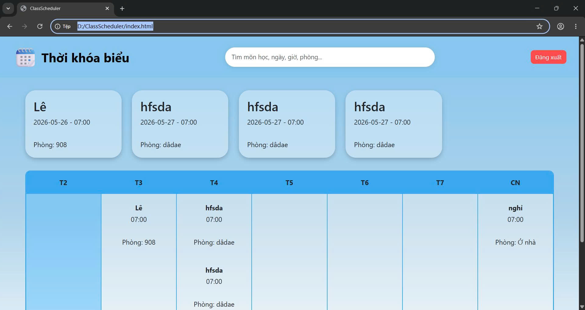
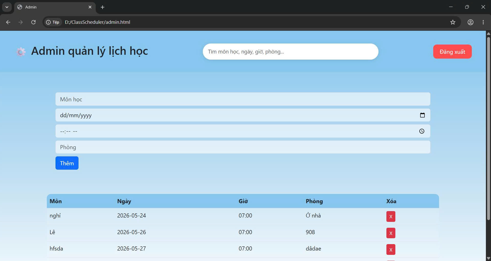
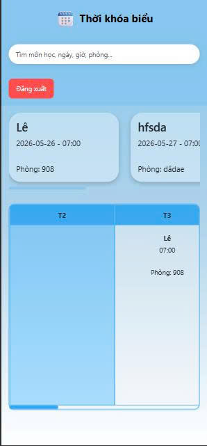

# ClassScheduler

Ứng dụng quản lý thời khóa biểu hỗ trợ người dùng và admin.

Dự án được xây dựng bằng HTML, CSS, JavaScript và MockAPI nhằm hỗ trợ quản lý lịch học dễ dàng trên mọi thiết bị.

---

# Demo Accounts

## Admin
- Username: admin
- Password: 123

## User
- Username: user1
- Password: 111

>Có thể đăng ký và tạo thêm tài khoản user

---

# Công nghệ sử dụng

- HTML5
- CSS3
- JavaScript
- Bootstrap 5
- jQuery
- MockAPI

---

# Tính năng

## User

- Xem thời khóa biểu
- Xem danh sách môn học
- Tìm kiếm môn học, ngày, giờ, phòng
- Responsive trên mọi thiết bị
- Giao diện hiện đại

## Admin

- Thêm lịch học
- Xóa lịch học
- Quản lý dữ liệu lịch học
- Responsive admin dashboard

## Authentication

- Đăng nhập
- Đăng ký
- Logout
- Phân quyền admin / user

> Lưu ý:
> Dự án sử dụng LocalStorage để mô phỏng hệ thống xác thực và phân quyền người dùng.
> Đây là project frontend demo nên chưa có bảo mật backend thực tế.

---

# Responsive Support

Hỗ trợ:

- Desktop
- Tablet
- Mobile

---

# Giao diện

## User Page



---

## Admin Page



---

## Mobile Responsive



---

# Cấu trúc thư mục

```txt
CLASSSCHEDULER/
│
├── index.html
├── admin.html
├── login.html
├── register.html
│
├── css/
│   ├── style.css
│   ├── admin.css
│   ├── login.css
│   └── register.css
│
├── js/
│   ├── api.js
│   ├── main.js
│   ├── admin.js
│   ├── login.js
│   ├── register.js
│   └── utils.js
│
├── img/
│   ├── user.png
│   ├── admin.png
│   └── mobile.png
│
└── README.md
```

---

# Kiến thức áp dụng

- Responsive Web Design
- Flexbox
- CSS Grid
- DOM Manipulation
- Fetch API
- LocalStorage
- CRUD Operations
- Mobile Responsive UI

---

# Các vấn đề đã giải quyết

- Responsive trên mobile
- Kéo ngang bảng thời khóa biểu
- Horizontal scroll cho card môn học
- Sticky topbar
- Responsive admin table
- Responsive search bar

---

# Hướng phát triển

- Chỉnh sửa lịch học
- Dark Mode
- Firebase Authentication
- Notification nhắc lịch học
- Đồng bộ dữ liệu cloud
- Calendar View

---

# Cách chạy project

1. Tải project về máy
2. Mở project bằng VS Code
3. Cài extension Live Server
4. Chuột phải vào `login.html`
5. Chọn `Open with Live Server`

---

# API

Dự án sử dụng MockAPI để lưu dữ liệu lịch học.

---

# Tác giả

Lê Văn Thiết
Đỗ Minh Hiếu
Phạm Tiến Anh